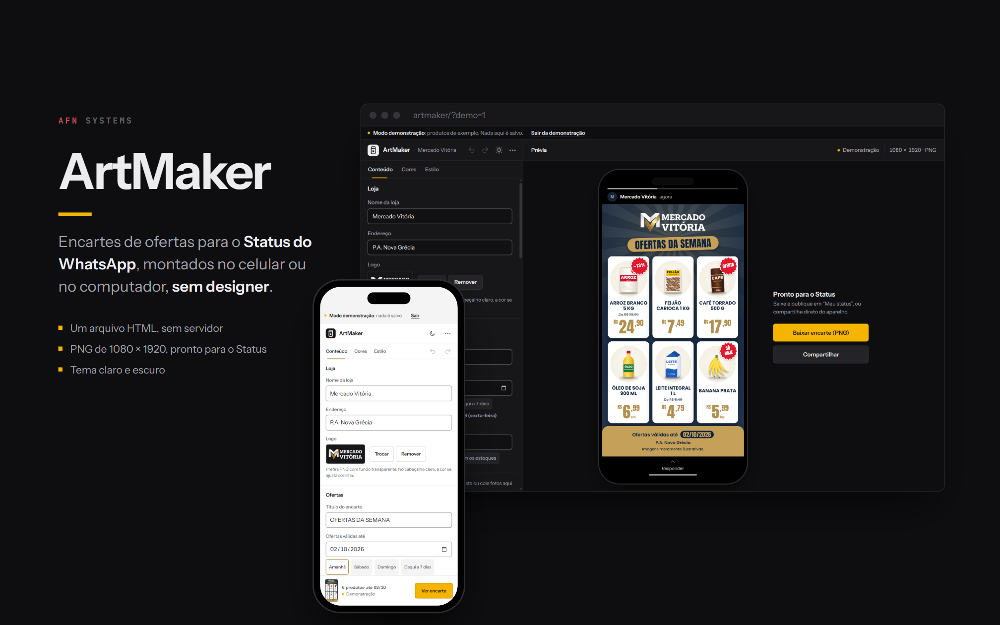
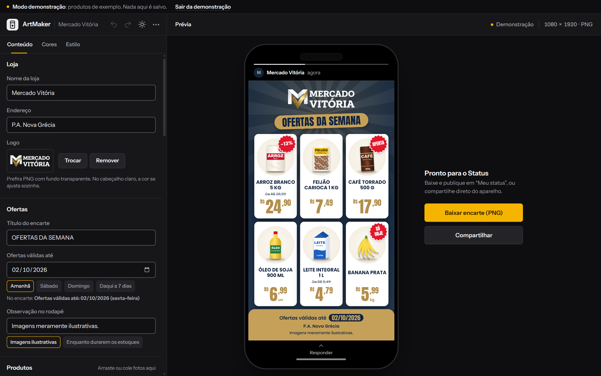
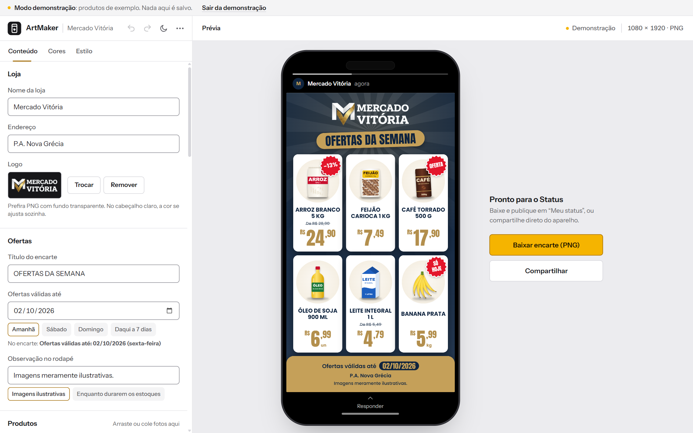
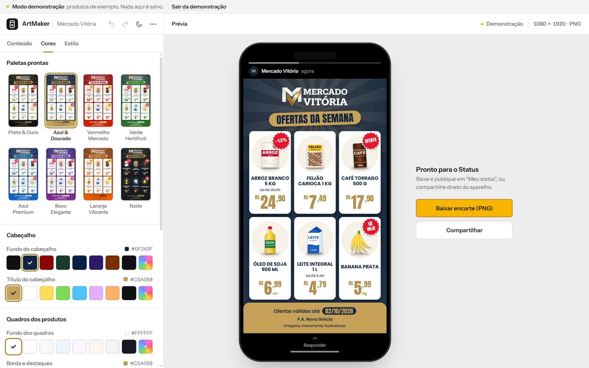
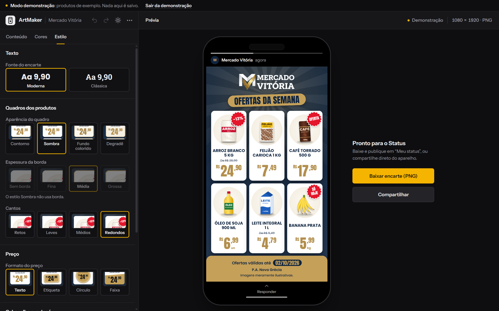
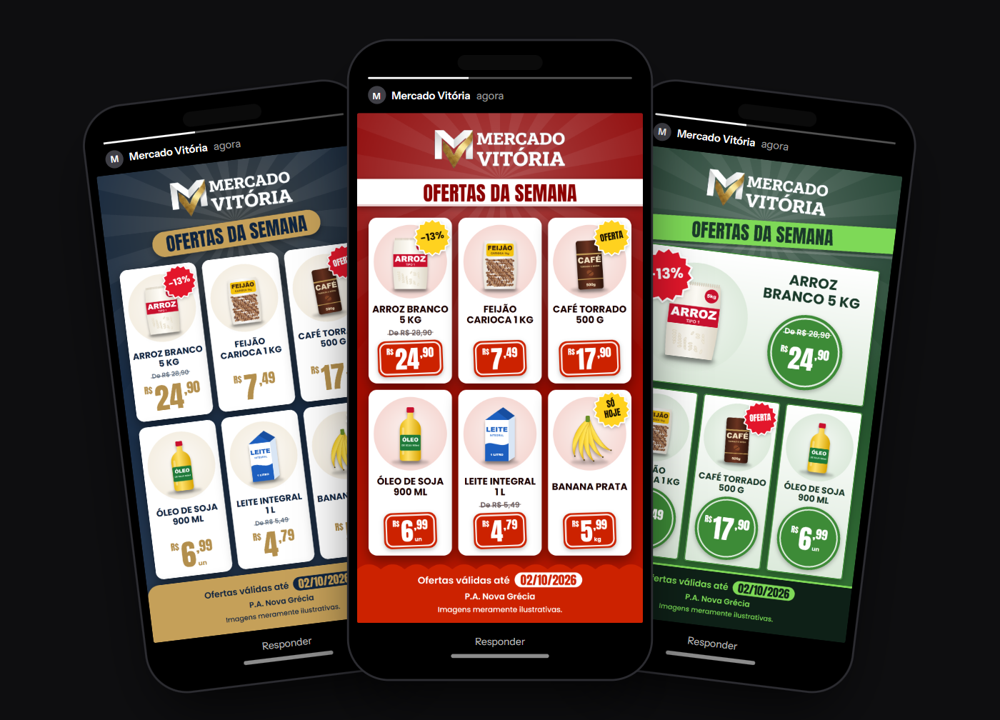
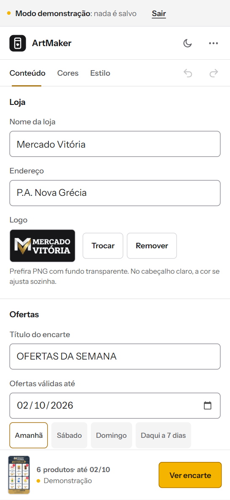

# ArtMaker



O ArtMaker monta encartes de ofertas no formato do Status do WhatsApp e
dos Stories (1080 × 1920). Foi feito para a dona do Mercado Vitória
publicar as promoções da semana sozinha, pelo celular ou pelo computador,
sem designer e sem aplicativo pago: ela escreve os produtos e os preços,
escolhe as fotos e baixa ou compartilha o encarte pronto.

É um arquivo HTML só, com JavaScript puro, sem framework, sem etapa de
build e sem servidor. Tudo fica no aparelho de quem usa.

**[Abrir o ArtMaker](https://alyssom-fernandes.github.io/ArtMaker/)** · **[Ver a demonstração](https://alyssom-fernandes.github.io/ArtMaker/?demo=1)**, um
encarte completo com seis produtos ilustrados, em que nada é salvo.

[](https://github.com/alyssom-fernandes/ArtMaker/actions/workflows/testes.yml)


Este README também está em [inglês](README.md).

## Em 30 segundos

1. Abra a [demonstração](https://alyssom-fernandes.github.io/ArtMaker/?demo=1).
2. Em **Cores**, troque a paleta; em **Estilo**, o formato do preço. O
   encarte muda na hora, e as miniaturas são o próprio encarte.
3. Toque em **Baixar**: sai um PNG de 1080 × 1920, pronto para o Status.

## Telas

Capturadas do modo demonstração.

| Editor, tema escuro | Editor, tema claro |
|---|---|
|  |  |
| **Cores, com as paletas desenhadas de verdade** | **Estilo, com miniaturas desenhadas pelo próprio motor do encarte** |
|  |  |

| Encartes gerados (PNG 1080 × 1920) | No celular |
|---|---|
|  |  |

## O que ele faz

### Montar o encarte

- De 1 a 6 produtos, cada um com nome, preço, unidade (kg, un, L…), foto,
  preço antigo ("De R$ … por R$ …") e selo (OFERTA, SÓ HOJE, ou o
  desconto em porcentagem calculado sozinho).
- A prévia é o próprio encarte e muda enquanto se digita. Enquanto falta
  foto, nome ou preço, ela diz o quê, e **Ir para o que falta** leva ao
  campo.
- Foto: escolher, arrastar para o produto, colar (Ctrl+V, útil com imagens
  copiadas do WhatsApp Web) ou selecionar várias de uma vez, que vão
  preenchendo os produtos sem foto. A foto é reduzida ao carregar, e as
  margens transparentes ou brancas são aparadas. Foto de catálogo com
  fundo branco perde o fundo com um toque (**Tirar fundo**).
- Validade por data, com atalhos (amanhã, sábado, domingo, daqui a 7
  dias), e observação no rodapé com sugestões como "Imagens meramente
  ilustrativas".
- Reordenar produtos, desfazer e refazer (Ctrl+Z, Ctrl+Shift+Z).

### Com a cara da loja

- Nome, endereço e logo da loja. Sem logo, o nome da loja vira a marca do
  cabeçalho, na fonte do título, em até duas linhas equilibradas. Com o
  cabeçalho claro, a parte branca ou preta da logo é recolorida sozinha,
  e o dourado continua dourado.
- 8 paletas, mostradas como miniaturas do próprio encarte, e cada uma das
  9 cores ajustável (8 sugestões e uma cor livre).
- Estilo: fonte moderna ou clássica, 4 aparências de quadro, espessura da
  borda, cantos, 4 cabeçalhos, 4 formas de preço (texto, etiqueta,
  círculo, faixa) e 4 rodapés.

### O encarte em si

- Feito para ser lido em dois segundos rolando o Status: fundo em degradê
  da paleta, título em maiúsculas num adesivo, produto sobre uma mancha
  de cor e preço numa fonte condensada e grande. Com 3 ou 4 produtos, o
  primeiro ganha destaque.
- Preço no formato de encarte de mercado: "R$" pequeno, reais grandes e
  centavos em cima.
- Nada estoura: títulos, nomes e endereços diminuem até caber e, no
  limite, terminam em reticências; número e unidade ("500 g") não se
  separam na quebra de linha.
- Nome e preço têm o mesmo tamanho em toda a linha de quadros, e as fotos
  ficam alinhadas.
- Contraste automático: se uma combinação de cores deixaria o texto
  ilegível, o tom é escurecido ou clareado só o necessário, sem trocar a
  cor escolhida. A aba Cores avisa quando isso acontece.
- O arquivo exportado não leva as marcas de edição ("Adicionar foto",
  "Informe o preço"); antes de baixar, o app avisa se falta foto, nome ou
  preço.

### Baixar, compartilhar e imprimir

- Baixar o PNG com a data no nome (`encarte-mercado-vitoria-2026-10-01.png`).
- Compartilhar direto pela folha do sistema (WhatsApp, Status, Fotos),
  onde o navegador permite. A imagem é preparada antes do toque, que é o
  que o iPhone exige.
- Imprimir: sai só o encarte, numa folha A4.
- Salvar o projeto num arquivo (`.artmaker.json`, com as fotos) e abrir
  depois, em outro aparelho.

### Não perde o trabalho

- Salva sozinho enquanto se edita: textos, cores e estilo no
  `localStorage`, fotos e logo no IndexedDB. Ao voltar, está tudo lá. Se
  a data das ofertas já passou, ela vira amanhã, com um aviso.
- Duas abas abertas não se atropelam: quando uma salva, a outra para de
  salvar e avisa, para não apagar o que foi feito.
- Falhas não tratadas ficam registradas no aparelho e aparecem em
  **Sobre**, com botões para copiar e apagar. No console,
  `errosRegistrados()` mostra as da página atual.

### Celular, temas e acessibilidade

- No computador, a prévia mostra o encarte dentro de um celular, com a
  moldura do Status do WhatsApp.
- No celular: as abas, com Desfazer e Refazer, ficam presas no topo, e
  uma barra embaixo mostra a miniatura viva do encarte. A prévia, o Sobre
  e o menu abrem como folhas, que fecham arrastando para baixo. No
  teclado, Enter leva ao campo seguinte.
- Tema claro e escuro, seguindo o aparelho até alguém escolher, sem
  piscar na abertura.
- Tudo funciona pelo teclado: abas com setas, paletas, cores e estilos
  como grupos de opções, foco visível, janelas que prendem o foco e fecham
  com Esc. Respeita "reduzir movimento" e o alto contraste do sistema.

## Como é feito

| Parte | Tecnologia |
|---|---|
| Interface | HTML, CSS e JavaScript, num arquivo só, sem framework |
| Desenho do encarte | Canvas 2D, 1080 × 1920 |
| Dados | `localStorage` para o estado, IndexedDB para as fotos |
| Compartilhar | Web Share API com arquivo |
| Fontes | Instrument Sans na interface; Anton, Poppins e Roboto Slab no encarte; JetBrains Mono na assinatura (Google Fonts) |
| Testes | `node --test`, sem dependências, rodando a cada envio (GitHub Actions) |

Algumas decisões por trás dele:

- **Um arquivo só, de propósito.** Dá para mandar o `index.html` para a
  dona do mercado e ele funciona. A logo padrão fica embutida (em WebP),
  porque uma imagem externa aberta direto do disco "contamina" o canvas e
  o navegador bloqueia o download.
- **O mesmo código desenha a prévia, o arquivo e as miniaturas.** A
  função de desenho recebe o contexto do canvas e, nas miniaturas da aba
  Estilo, um recorte do encarte; a exportação desenha num canvas à parte,
  sem as marcas de edição.
- **As contas que decidem o que sai no encarte são testadas**: leitura do
  preço digitado do jeito brasileiro, desconto, contraste, ajuste de cor,
  datas locais, nome do arquivo, id das fotos e a migração dos dados
  salvos por versões antigas. O teste recorta o bloco de funções puras do
  próprio `index.html`.

## Limitações conhecidas

- As fontes vêm do Google Fonts. Sem internet na primeira abertura, o
  encarte sai com fontes do sistema.
- **Compartilhar** precisa de HTTPS e de um navegador que compartilhe
  arquivos (Chrome no Android, Safari no iPhone). No computador, quase
  sempre só aparece o **Baixar**.
- Fotos HEIC (o padrão da câmera do iPhone) só abrem nos navegadores que
  leem esse formato, como o Safari. Nos outros, o app pede um JPG.
- Os dados ficam no navegador do aparelho. Limpar os dados do site apaga
  o encarte; para guardar ou levar a outro aparelho, use **Salvar
  projeto em arquivo**, no menu.
- A interface é só em português.

## Como usar a sua cópia

1. Baixe o `index.html` e abra no navegador. Só isso.
2. Troque o nome, o endereço e a logo da loja na aba **Conteúdo**. A
   logo nova fica guardada no aparelho.
3. Para ter o botão **Compartilhar** no celular, o arquivo precisa estar
   num endereço com HTTPS (o GitHub Pages serve); aberto direto do disco,
   o navegador não libera o compartilhamento de arquivos, e o **Baixar**
   continua funcionando.

Para rodar os testes (Node 18 ou mais novo, sem instalar nada):

```bash
node --test
```

## Estrutura

```
index.html            o app inteiro: interface, desenho do encarte e a logo padrão
404.html              página de endereço não encontrado
tests/
  puro.test.mjs       testes das funções puras do index.html
.github/workflows/
  testes.yml          roda os testes a cada envio
docs/telas/           imagens deste README e a prévia de link (og.png)
```

## Licença

[MIT](LICENSE). Feito por [Alyssom Fernandes](https://github.com/alyssom-fernandes), AFN Systems.
